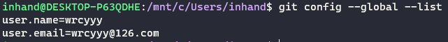

# git commit

## 撤销上一次的commit操作

* 仅在本地commit还未push

```shell
git reset --soft|--mixed|--hard <commit_id>
```

这里的<commit_id>就是每一次commit的SHA-1，可以在log中查看

> 参数说明
> - --mixed 会保留源码，只是将git commit和index 信息回退到了某个版本
> - --soft 保留源码,只回退到commit信息到某个版本.不涉及index的回退,如果还需要提交,直接commit即可
> - --hard 源码也会回退到某个版本,commit和index 都会回退到某个版本.(注意,这种方式是改变本地代码仓库源码)

* 代码已经commit并push到远程仓库

对于已经把代码push到线上仓库,你回退本地代码其实也想同时回退线上代码,回滚到某个指定的版本,线上、线下代码保持一致.你要用到下面的命令

```shell
git revert <commit_id>
```

revert 之后你的本地代码会回滚到指定的历史版本,这时你再 git push 既可以把线上的代码更新。
> 注意：git revert是用一次新的commit来回滚之前的commit，git reset是直接删除指定的commit，看似达到的效果是一样的,其实完全不同。

# git config命令

* 查看git配置

> git config --global --list



* 设置代理和取消代理

> - git config --global http.proxy http://127.0.0.1:1080
> - git config --global http.proxy 'socks5://127.0.0.1:1080'
> - git config --global http.proxy 'socks5h://127.0.0.1:1080'
> - git config --global --unset http.proxy

* 指定网址进行代理

> - git config --global http.https://github.com.proxy http://127.0.0.1:1080

# git tag操作

* 新建tag

> git tag -a <tag_name> -m <tag_desc>

* 删除tag

> git tag -d <tag_name>

* 推送tag到远程分支

> git push --tags

* 查看本地tag

> git tag -ln

* 获取指定tag的代码

> git checkout <tag_name>