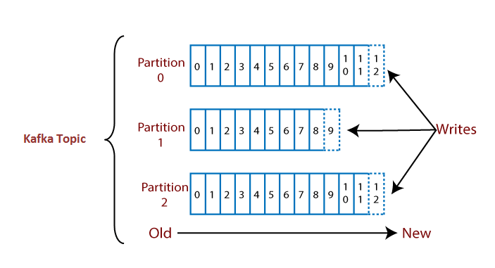
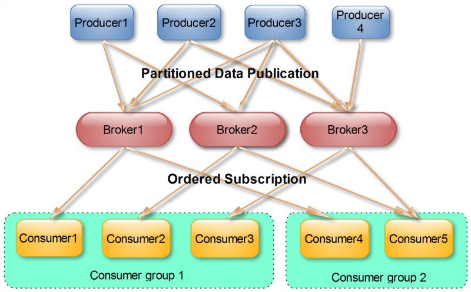

# Kafka是什么
Kafka是一个分布式的流处理平台

Kafka最早是由LinkedIn公司开发，作为其自身业务消息处理的基础；后LinkedIn公司将Kafka捐赠给Apache，现在已经成为Apache的一个顶级项目了。Kafka作为一个高吞吐的分布式的消息系统，目前已经被很多公司应用在实际业务中了，并且与许多数据处理框架相结合，比如Hadoop、Spark等。


# Kafka关键特性

- 同时为发布和订阅提供高吞吐量
- 可用于批量消费（如ETL）和实时应用程序。通过将数据持久化到磁盘以及replication防止数据丢失
- 分布式系统，易于向外扩展。所有的producer、broker和consumer都会有多个，均为分布式的，无需停机即可扩展机器
- Kafka批处理可以一次压缩多个消息后发送到服务器，这批消息将以压缩格式写入，并且在日志中保持压缩，只会在consumer消费时解压缩。极大降低了数据传输过程中的网络带宽占用

# Kafka的基本概念
> Topic

Kafka处理消息源的不同分类
> Partition

Partition是物理上的概念，每个Topic包含一个或者多个Partition
> Producers

消息和数据的生产者，生产者是发送一个或者多个Kafka主题消息的发布者
> Consumers

消息和数据的消费者，Consumer可以通过Broker从某个Topic的指定分区中获取消息
> Consumer Group

每个Consumer属于一个特定的Consumer Group，可以为每个Consumer指定group name，如果不指定group name则属于默认的group

> Broker

可以简单理解为一个Kafka节点，多个Broker节点构成整个Kafka集群

## Topics/Log && Partition


- 一个Topic可以认为是一类消息，每个Topic将被分成多个Partition，每个Partition在存储层面是append log文件。
- 任何发布到此Partition的消息都会被直接追加到log文件的尾部，每条消息在文件中的位置称为offset（偏移量）
- Logs文件根据Broker中的配置要求，保留一段时间后删除来释放磁盘空间
- Kafka基于文件存储。通过分区可以将日志内容分散到多个server上，来避免文件尺寸达到单机磁盘的上限，每个Partition都会被当前server（Kafka实例）保存
- 可以将一个topic切分为任意多个Partition
- 越多的Partitions意味着可以容纳更多的Consumer，能够有效提升并发消费的能力

## Consumer && Producers && Consumer Group

> Producer(消息和数据的产生者，发布消息给一个或者多个Topic)

- Producer将消息发送到指定的Topic中，且能够决定此消息归属于哪个Partition
- 批量发送可以有效提高发送效率。Producer的异步发送模式允许进行批量发送，可先将消息缓存在内存中然后一次请求发送出去

> Consumer(消息和数据的消费者)

- Consumer可以通过Broker从某个Topic的指定分区的指定位置中获取消息
- Consumer可以回退到之前的offset并再次消费之前的数据

> Consumer Group(包含多个Consumer的分组)

- 允许Consumer Group对一个Topic进行消费
- 不同的Consumer Group之间独立订阅
- 可以认为一个Consumer Group为一个订阅者，一个Topic中的每个Partition只会被一个订阅者中的一个Consumer消费；不过一个Consumer可以消费多个Partition中的消息。
- Kafka只能保证一个Partition中的消息被某个Consumer消费时，消息是顺序的。但从Topic的角度来说，消息仍不是有序的
- Kafka设计原理决定了对于一个Topic，同一Consumer Group中不能有多于Partitions个数的Consumer，否则有部分Consumer无法得到消息

## Broker

- Kafka集群包含一个或多个服务器，服务器节点称为Broker
- 为了减少磁盘写入的次数，Broker会将消息暂时buffer起来，当消息的个数（或尺寸）达到一定阈值时，在flush到磁盘，这样减少了磁盘IO调用的次数

> Broker的无状态机制
- Broker没有副本机制，一旦Broker宕机，改Broker的消息将都不可用
- 无状态导致消息的删除称为难题（可能删除的消息正在被订阅），Kafka采用基于时间的SLA（服务水平保证），消息保存一定时间（通常为7天，也可以自定义）后会被删除
- 消息订阅者可以rewind back到任意位置重新进行消费，当订阅者故障时，可以选择最小的offset进行重新读取消费信息

# Kafka服务搭建及使用
## 服务搭建
这里简单介绍一下单个Broker的Kafka服务搭建

> 创建docker-compose.yml文件

```yaml
version: '2'
services:
  zookeeper:
    image: wurstmeister/zookeeper
    ports:
      - "2181:2181"
  kafka:
    ports:
      - "9092:9092"
    environment:
      KAFKA_ADVERTISED_HOST_NAME: 192.168.99.100
      KAFKA_CREATE_TOPICS: "test:1:1"
      KAFKA_ZOOKEEPER_CONNECT: zookeeper:2181
    volumes:
      - /var/run/docker.sock:/var/run/docker.sock
```
> 使用`docker-compose up -d`启动容器

## 简单上手
资源创建需要在容器控制台进行
> 创建Topic

`bin/kafka-topics.sh --create --zookeeper localhost:2181 --replication-factor 1 --partitions 1 --topic test_topic_wrc`

- --replication-factor 参数用于指定该Topic的副本数
- --partitions 参数指定该Topic的分区数
> 创建Producer

`bin/kafka-console-producer.sh --broker-list localhost:9092 --topic test`

执行上述命令后在控制台输入信息就可以发送到服务器上了
> 创建Consumer

`bin/kafka-console-consumer.sh --bootstrap-server localhost:9092 --topic test --from-beginning`
- --from-beginning用于从分区起始位置读取数据

Producer发送数据后，Consumer就能立即收到相同的数据了
